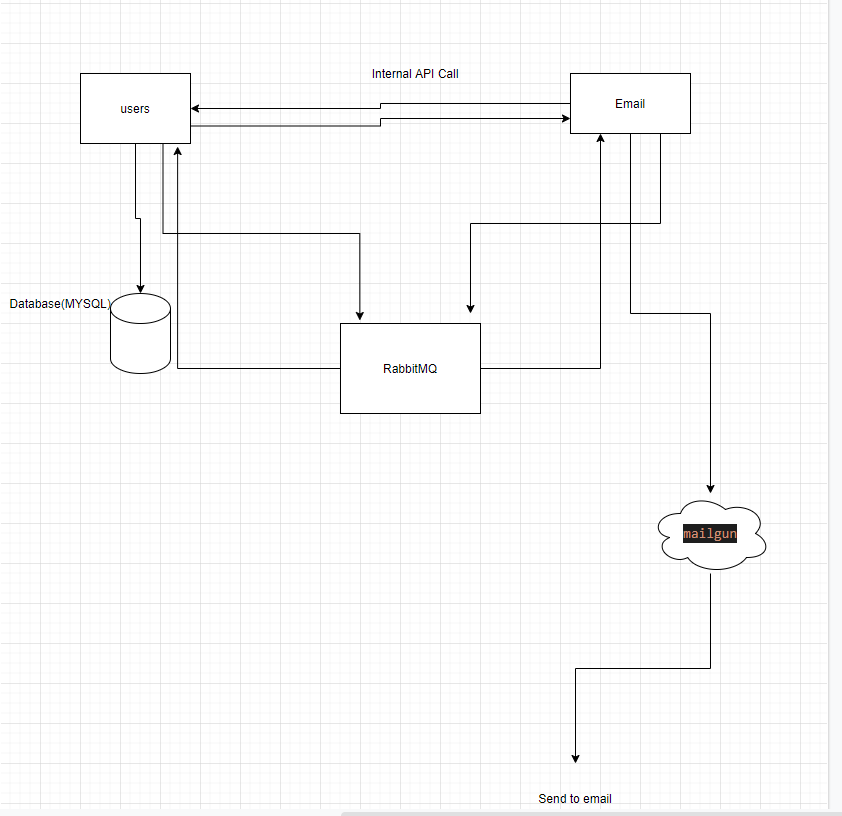
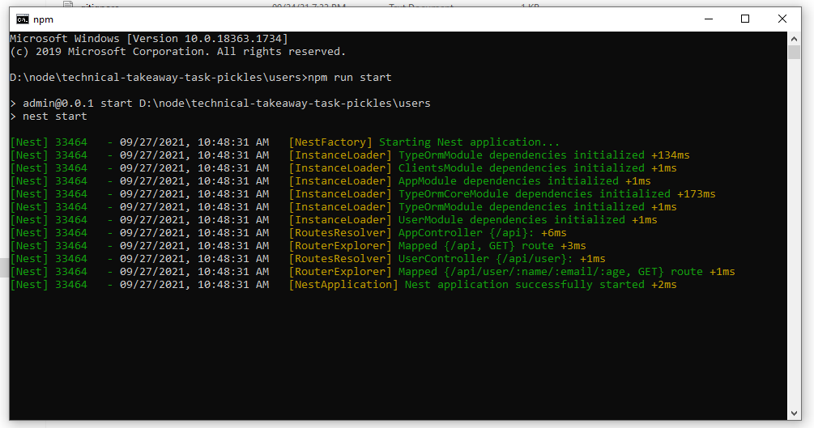
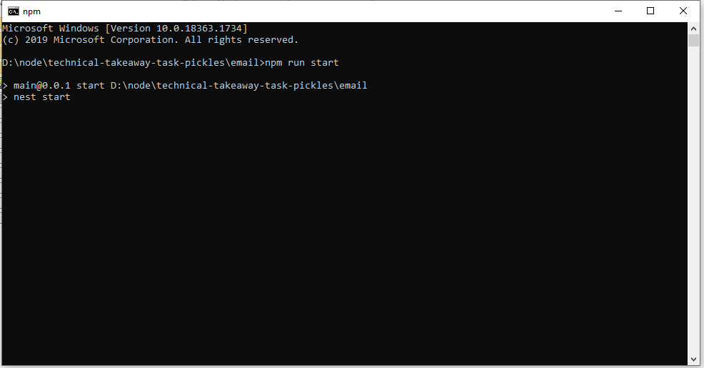
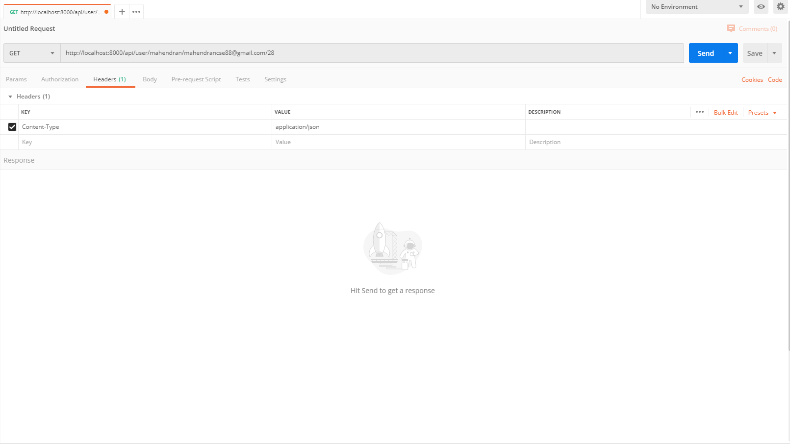
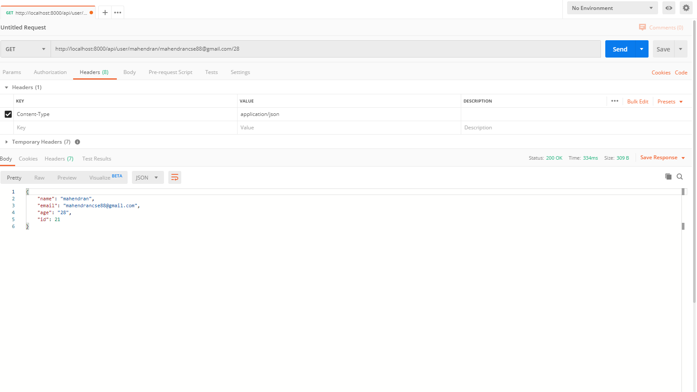
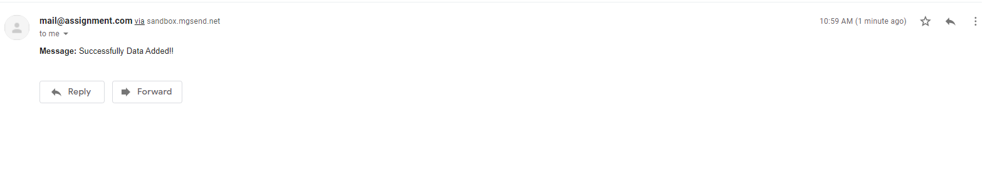

# technical-takeaway-task-pickles

  <!--[](https://opencollective.com/nest#backer)
  [](https://opencollective.com/nest#sponsor)-->

## Architecture



## Mysql Database 


1. create database 
2. goto users/src/app.module.ts file changes database details(host, username, password, database)


## Installation
run
```bash
$ npm install
```

## Running the app


Run on users floder 
1. Open comment prompts cd users 
2. enter npm install 


```bash
# development
$ npm run start

# watch mode
$ npm run start:dev

# production mode
$ npm run start:prod
```

Run on email floder 
1. Open comment prompts cd email 
2. enter npm install 


```bash
# development
$ npm run start

# watch mode
$ npm run start:dev

# production mode
$ npm run start:prod
```

# Test API

```bash
Open Postman 
http://localhost:8000/api/user/:name/:email/:age
1. Name string format
2. Email must be use valid that send to mail  
3. age number
look like better as below

http://localhost:8000/api/user/mahendran/mahendrancse88@gmail.com/28
```



